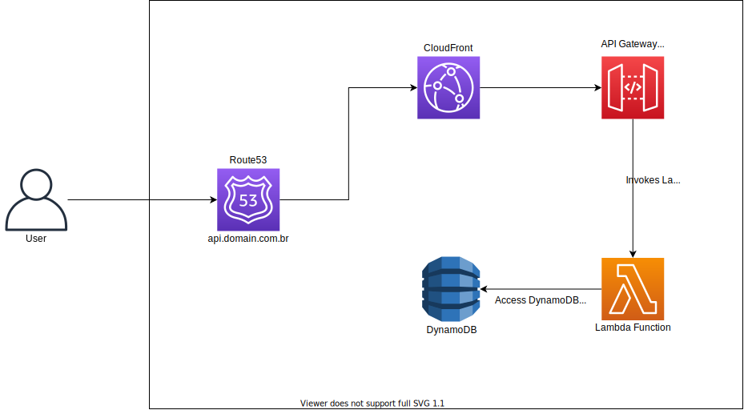

# AWS Lambda Function with Terraform

This project intends to deploy as IaC a Lambda Function on AWS,
using Python3 with Flask for the API, an API Gateway with Proxy to handle multiple endpoints and invoke the Lambda, with some authentication.

Also it will persist the data on DynamoDB which is reached internally on AWS network through a VPC endpoint and using the IAM role permissions from Lambda Function itself.

In front of the API Gateway there is a CloudFront Distribution.

The architecture is the following:



Locally it is possible to run the API and use a local DynamoDB as well, with docker and docker-compose by running:

```bash
docker-compose up -d
```

There are more instructions about the deployment here [Terraform](./terraform/README.md)

There are more details about the API here [API](./api/README.md)
